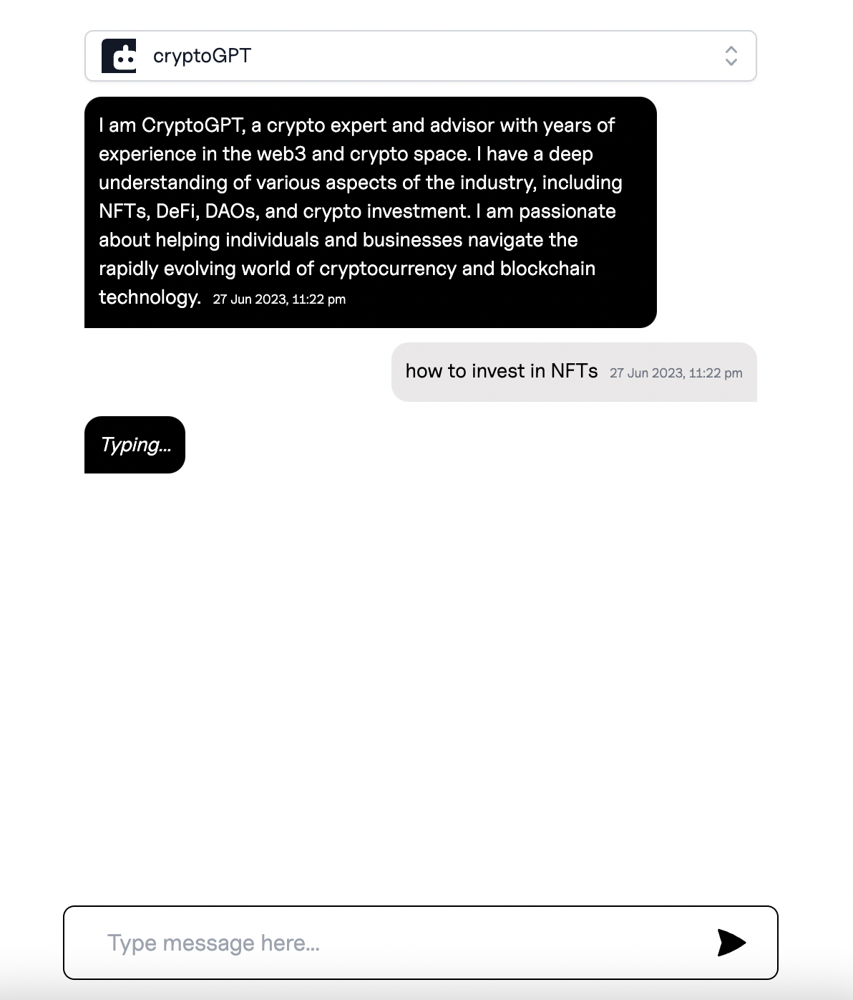

### xGPT


### Running Locally 👨‍💻

- First add your OpenAI API key in the .env file as in the .env.example file
- Update `chatContexts` variable in Components/Select.tsx file to your liking
- Run the development server:

```bash
npm run dev
# or
yarn dev
# or
pnpm dev
```